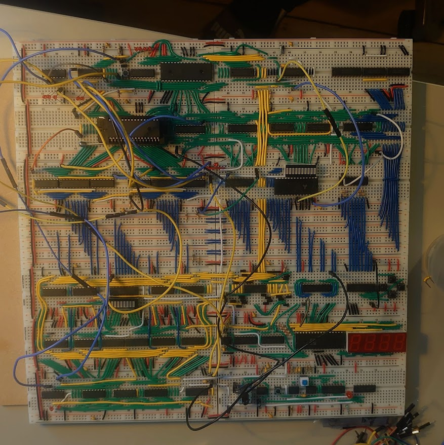

# 8 bit breadboard CPU

Welcome to the github repo for my 8 bit breadboard CPU. I will add info and documentation as the project progresses.

Current state: all connectivity tested (with some jumper wires still). Basic instructions functional, flags not connected to control.

## Features

- 8 bit data, 8/16/.. bit instructions (up to 65.5k)
- 256B RAM, direct + indirect addressing
- Up to 65.5k instructions, 256 types of <16 microstep each
- Harvard architecture (to not need bootloader)