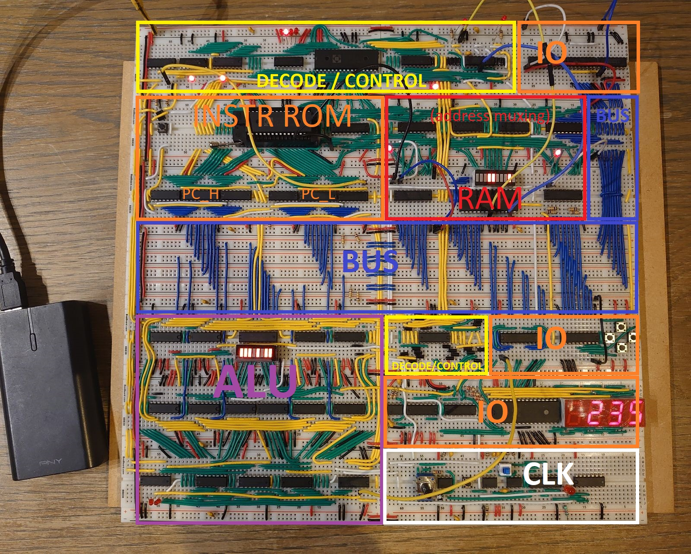
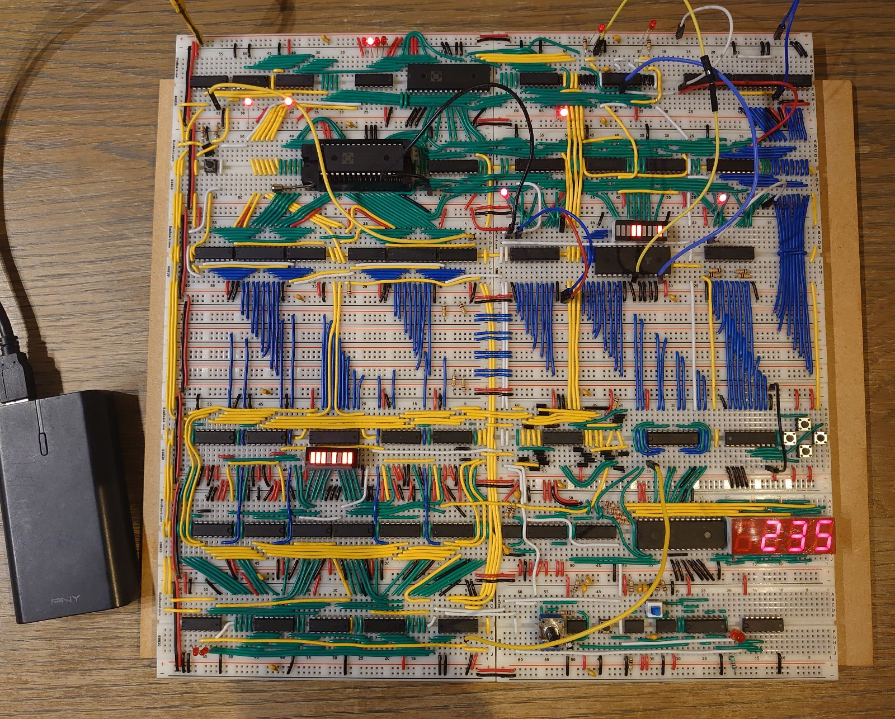

# 8 bit breadboard CPU

Welcome to the github repo for my 8 bit breadboard CPU. I will add info and documentation as the project progresses.

unmarked image on bottom

## Features

- 8 bit data, 8/16/.. bit instructions (up to 65.5k)
- 256B RAM, direct + indirect addressing
- Up to 65.5k instructions; 256 types, each up to 16 µstep
- Harvard architecture (to not need bootloader)

## HW TODO

- Hook up I2C display
- Test full instruction set

## SW TODO

- Add more complex instructions (stack?)
- (add kicad project)
- (add high level schematic)
- (EEPROM-arduino\display-decoder => negative number support)
- (Test driving I2C display without any libs)
- (Compiler)

## State

Current state: all connectivity tested (with some jumper wires still). Basic instructions functional, flags not connected to control.

